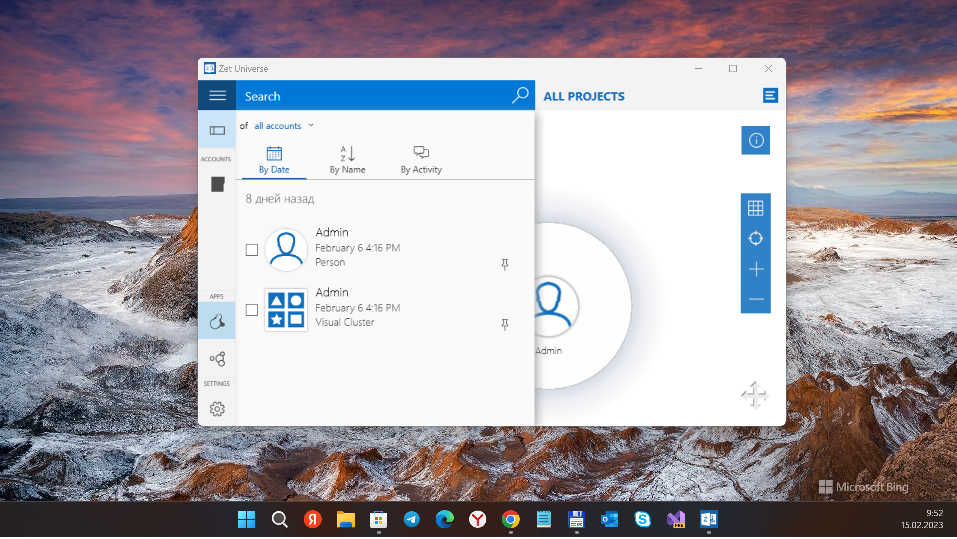
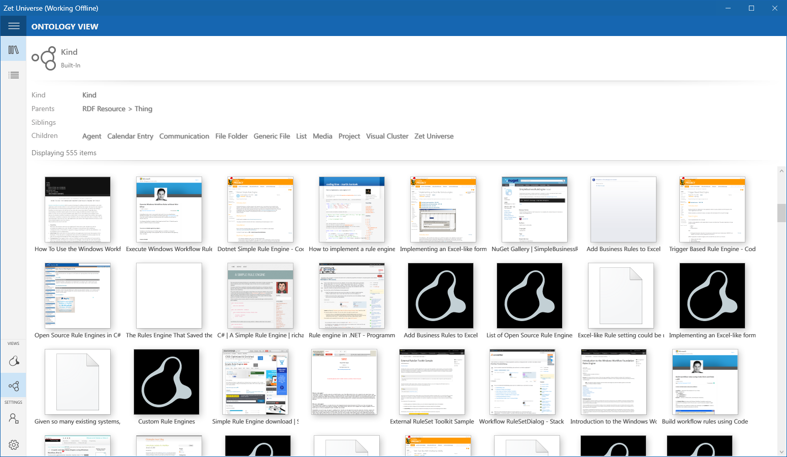

# ZUSDK 
My Research&Dev (RnD) of/to Zet Universe Software Development Kit (SDK)

## [R]esearch
- https://www.zetuniverse.com Old site about ZetUniverse "startup company" (URL seems to be blocked or switched off... idk)
- https://www.zetuniverse.com/blog Useful blog which contains some ZU "blog items" (use Time Machine service to see it)
- https://zetuniverse.nyc3.digitaloceanspaces.com/ "Archive" of ZU builds and nuget packages 
- https://www.youtube.com/watch?v=PZijT83spMs Infinite Zoomable Desktop from Productivity Future Vision 2019
- https://marketplace.visualstudio.com/items?itemName=DanielKornev.ZetUniverseSDKProjectTemplates

## [&]nd
- ZUSDK_docs.shfbproj ("SDK docs") project removed from VS solution (reason: incompatibility with VS 2022/25 Preview)

## [D]ev
- "SDK docs"project will be slowly transformed onto Wiki 

## SDK How-tos
- Try to download [Zet Universe](https://www.zetuniverse.com). 
You can find latest iteration at Microsoft Store by search "ZetUniverse"... or use "direct link construction" 
(https://zetuniverse.nyc3.digitaloceanspaces.com/ + /backups/...) 

To simplify plugin development for [Zet Universe](https://www.zetuniverse.com) app, 
you can use Visual Studio project templates for the C# language. 
These new projects are found in the "Zet Universe" node when you open the File/New/Project dialog in Visual Studio. 
These projects enable you to get started quickly building Zet Universe plugins with Visual Studio.

Zet Universe Projects
- Use the Zet Universe ZProcessor Project
- Use the Zet Universe ZApp Project
- The files for the template that you selected are added to the project. You can start adding functionality to your item template, 
press F5 to run the project, or add additional item templates.

Run and debug
- To run the project, press F5. Visual Studio will:

Build the plugin from the template project.
- When debugging, restart an instance of Zet Universe with your new plugin.

## References
- https://github.com/danielkornev/ZUSDK Original ZU SDK "corner"
- https://github.com/danielkornev Daniel Kornev CPO @ DeepPavlov.ai. Helped ship smartspeaker Yandex Station and part 
of Yandex AI assistant Alice. Worked for Microsoft, Google.

## ..
AS IS. No support. RnD only / DIY

## .
[m][e] 2023

